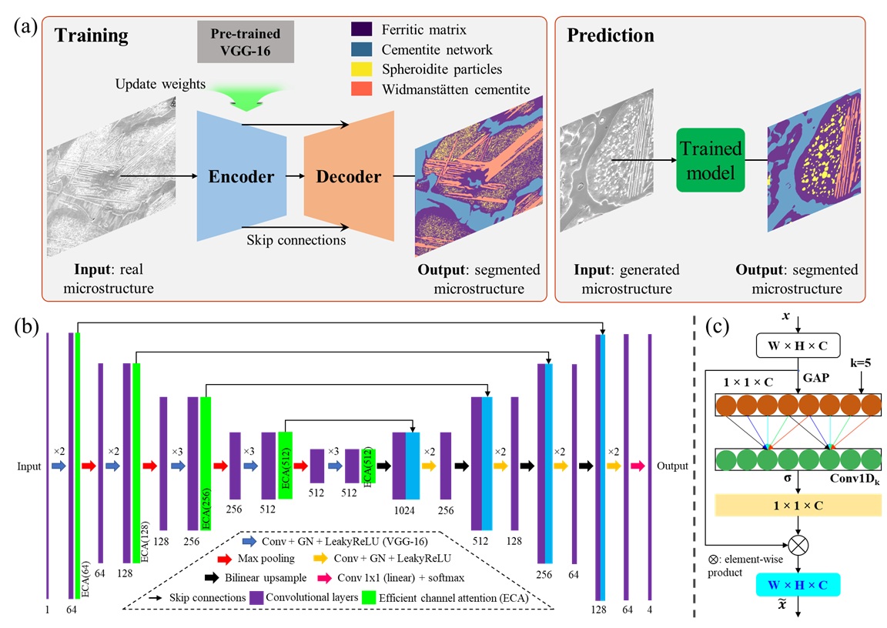
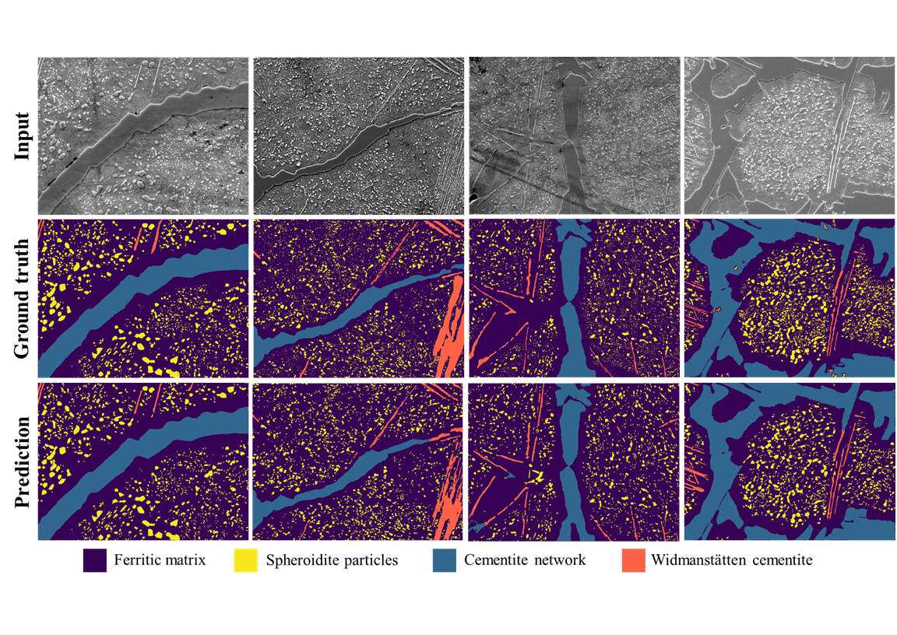
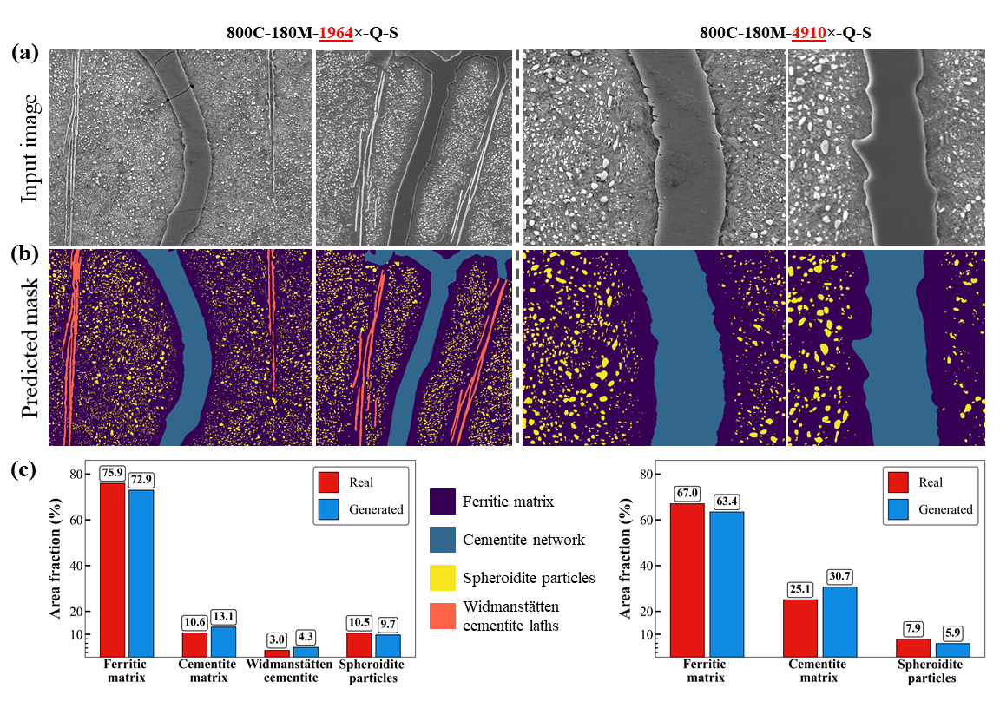

# Microstructure Semantic Segmentation (UHCS + Aachen)

For microstructure generation (SD3.5 DreamBooth+LoRA), see: https://github.com/tuyencuong/sd35-dreambooth-lora-param-aware


Semantic segmentation framework for microstructure validation. (a) U-Net with a pre-trained VGG-16 encoder is fine-tuned on the labeled UHCS micrographs and then applied to real/generated images to predict four microconstituent classes. (b) Detailed architecture with efficient channel attention (ECA, green) integrated after each encoder convolutional block (purple), enabling channel-wise refinement without dimensionality reduction, alongside group normalization, LeakyReLU activations, max pooling (red arrows), bilinear upsampling (green/yellow arrows), and skip connections (black) for robust feature fusion despite class imbalance and data scarcity. (c) Zoomed ECA module: post-conv features (W×H×C) undergo global average pooling (GAP) to 1×1×C, followed by 1D convolution with kernel k = 5, sigmoid activation, and element-wise multiplication (×) back to original features for efficient cross-channel interaction.

This repository provides a single, consistent segmentation pipeline for two microstructure datasets while preserving compatibility with existing trained checkpoints:

- `aachen`: binary segmentation
- `uhcs`: 4-class segmentation

The codebase unifies data loading, model construction, training, evaluation, and folder-based inference in one implementation.

## 1. Reference
For full method details, experiments, and scientific context, see the paper:

- https://doi.org/10.1016/j.aei.2025.104080

## 2. Core Design

- Unified model registry for Aachen and UHCS variants.
- Backward-compatible loading for legacy checkpoints.
- Shared CLI workflow for training (`train.py`) and evaluation (`eval.py`).
- Standalone inference utility (`Segment.py`) with automatic variant/class inference.
- Supported split strategies: `MetadataCSV`, `TextSplit`, `CSVSplit`.

## 3. Repository Layout

```text
Semantic-segmentation-on-UHCS-and-Aachen/
  args.py
  datasets.py
  train.py
  eval.py
  Segment.py
  utils.py
  UNet/
    __init__.py
    unet.py                # Aachen baseline variant
    unet_uhcs_legacy.py    # UHCS legacy-compatible variant
    unet_parts.py
  configs/
    aachen/default.yaml
    uhcs/default.yaml
  checkpoints/
    aachen/trained_segmentation_Aachen.pth
    uhcs/trained_segmentation_UHCS.pth
```

## 4. Environment

git clone https://github.com/tuyencuong/Semantic-segmentation-on-UHCS-and-Aachen.git
cd Semantic-segmentation-on-UHCS-and-Aachen
python -m venv .venv
source .venv/bin/activate
pip install -r requirements.txt

Use the project virtual environment:

```bash
source /home/cuong/OLD_NOT_GOOD/KIMS_trivial/.env/bin/activate
```

Core dependencies used in this repository include `torch`, `torchvision`, `albumentations`, `opencv-python`, `numpy`, `pandas`, `Pillow`, `PyYAML`, and `tqdm`.

## 5. Dataset Expectations

Set dataset roots through `--dataset_root` (or in config). The defaults are:

- Aachen config: `configs/aachen/default.yaml`
- UHCS config: `configs/uhcs/default.yaml`

Main config fields:

- `dataset_root`
- `img_folder`, `label_folder`
- `split_info`
- `n_classes`
- `model_variant`
- `label_mode` (`binary_nonzero` for Aachen, `raw` for UHCS by default)

Typical data layouts:

```text
# Aachen (MetadataCSV split)
<dataset_root>/
  metadata.csv
  train/inputs/...
  train/targets/...
  val/inputs/...
  val/targets/...
  test/inputs/...
  test/targets/...
```

```text
# UHCS (TextSplit split)
<dataset_root>/
  images/...
  labels/...
  splits/
    train.txt
    val.txt
    test.txt
```

## 6. Training

### Aachen

```bash
python train.py \
  --dataset aachen \
  --config default.yaml \
  --dataset_root /path/to/aachen_data \
  --gpu_id 0
```

### UHCS

```bash
python train.py \
  --dataset uhcs \
  --config default.yaml \
  --dataset_root /path/to/uhcs_data \
  --gpu_id 0
```

Common overrides:

- `--output_dir /path/to/output`
- `--batch_size 6`
- `--n_epochs 200`
- `--encoder_lr 1e-4 --decoder_lr 1e-4`
- `--save_every 20`
- `--encoder_pretrained` or `--no_encoder_pretrained`
- `--multi_gpu` (DataParallel over visible GPUs)

Training artifacts:

- `model.pth` (latest)
- `best_model.pth` (best by validation mIoU)
- `checkpoint_epoch_<N>.pth` (if `save_every > 0`)
- `train_record.csv`
- `train_results.txt`
- `args.yaml`

## 7. Evaluation

```bash
python eval.py \
  --dataset aachen \
  --config default.yaml \
  --dataset_root /path/to/aachen_data \
  --model_path /path/to/checkpoint.pth \
  --mode val \
  --save_pred
```

Notes:

- `eval.py` auto-detects model variant from checkpoint keys.
- If checkpoint output head differs from config `n_classes`, checkpoint head is used.
- `--mode` must be `val` or `test`.

## 8. Folder Inference

```bash
python Segment.py \
  --image_dir /path/to/images \
  --model_path /path/to/checkpoint.pth \
  --output_dir /path/to/output \
  --gpu_id 0 \
  --model_variant auto
```

Generated files per image:

- `*_input.png`
- `*_mask.png`
- `*_overlay.png`
- `*_mask.npy` (unless `--no_save_npy`)

Size behavior:

- Saved outputs preserve the original input image resolution.
- If `--image_size W H` is used for model inference, predictions are resized back to the original image size before saving.

Overlay behavior:

- Non-mask background pixels are preserved from the input image.
- Alpha blending is applied only on predicted foreground classes.

## Our checkpoints (Shared via Hugging Face)

Pretrained / shared checkpoints are published here:

- https://huggingface.co/Hoang-Cuong/SD3.5-for-continuous-and-categorical-conditions/tree/main

## 9. Quick Check with Included Checkpoints

### Aachen checkpoint

```bash
python Segment.py \
  --image_dir /path/to/aachen_inputs \
  --model_path checkpoints/aachen/trained_segmentation_Aachen.pth \
  --output_dir ./outputs/aachen_demo \
  --model_variant auto
```

### UHCS checkpoint

```bash
python Segment.py \
  --image_dir /path/to/uhcs_inputs \
  --model_path checkpoints/uhcs/trained_segmentation_UHCS.pth \
  --output_dir ./outputs/uhcs_demo \
  --model_variant auto
```

## 10. Example Results



Qualitative examples of predicted masks and overlays.




## 11. License
The code in this repository is released under the **Apache-2.0** License (see `LICENSE`).

**Important notes:**
- Verify your intended use (including commercial use) against all applicable licenses and policies for datasets/checkpoints you use.
- If you use this code or the released checkpoints in academic work, please **cite the paper** below.

---

## 12. Author

- Hoang Cuong Phan

## 13. Citation

```bibtex
@article{
  title        = {Parameter-aware high-fidelity microstructure generation using stable diffusion},
  journal      = {Advanced Engineering Informatics},
  volume       = {69},
  pages        = {104080},
  year         = {2026},
  month        = jan,
  doi          = {10.1016/j.aei.2025.104080},
  url          = {https://doi.org/10.1016/j.aei.2025.104080},
  publisher    = {Elsevier BV},
  author       = {Phan, Hoang Cuong; Tran, Minh Tien; Lee, Chihun; Kim, Hoheok; Oh, Sehyeok; Kim, Dong-Kyu; and Lee, Ho Won}
}
```
